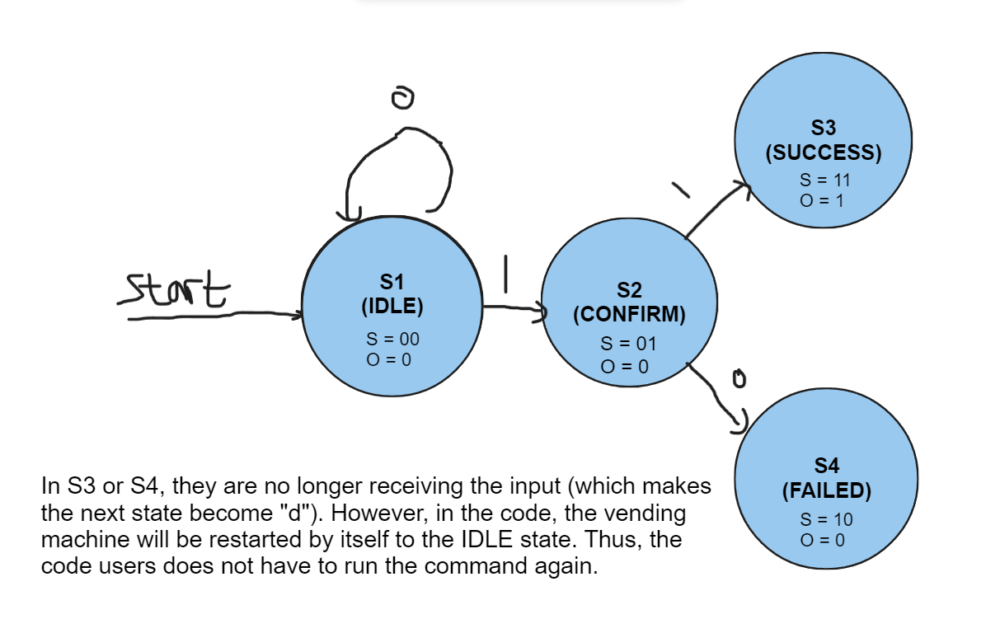
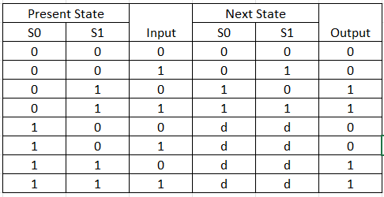
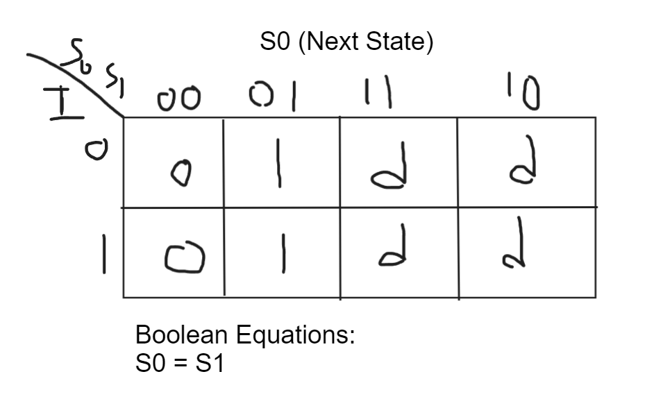
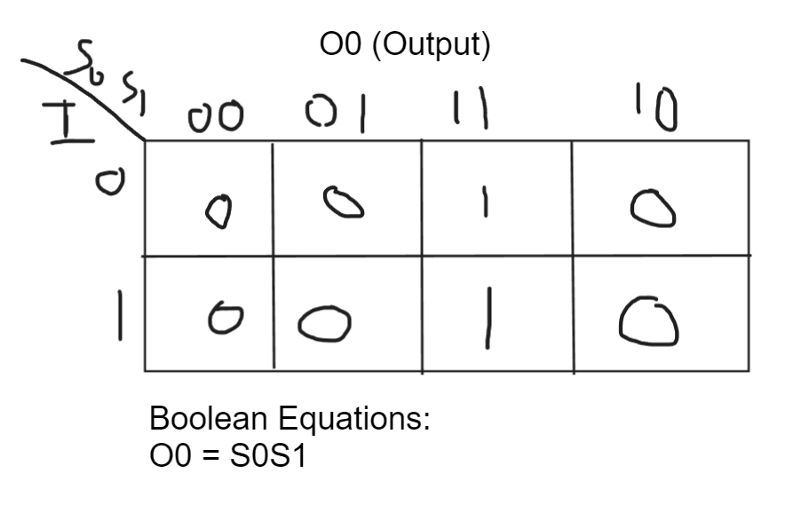
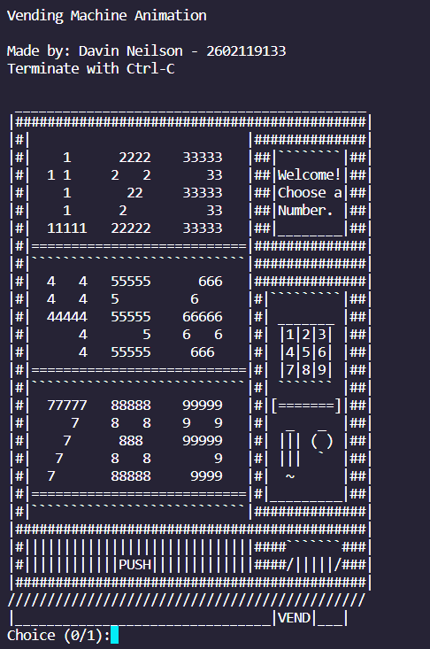
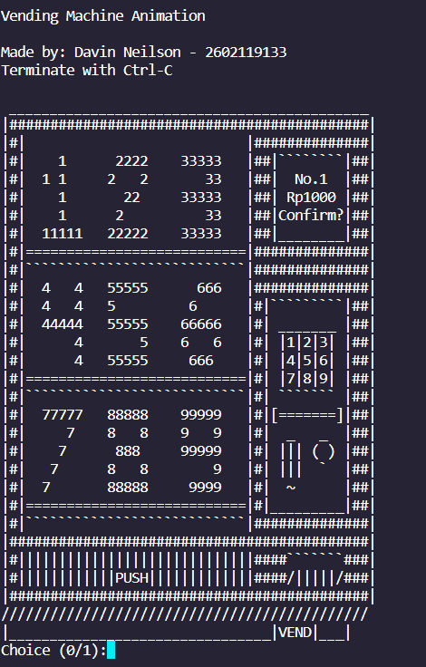
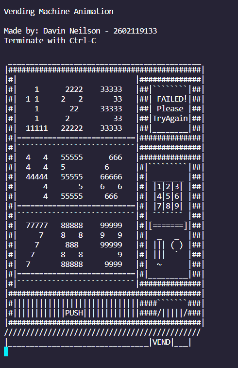

# Vending Machine - Finite State Machine
## Finite State Machine
In here, we will see how the FSM works in the Vending machine. \
The FSM image can be found here:


## Table
Here's the truth table for the FSM: \
Let say "0" indicates "No" and "1" indicates "Yes"
When the machine starts, the first state will be in the IDLE state. If the user put "0" in the idle state, the machine will stay in idle state until the user puts "1" which will move to the next state. The next state is the CONFIRM state, the CONFIRM state has two ways to go if it is inputted. First, by inputting 0 in that state, it will go to the "FAILED" state which is not an accepting state. However, if it is inputted "1", it will go to the "SUCCESS" state or the accepting state.



## Karnough Map and The derived Boolean equations
Here's the Karnough map and the derived boolean equations for the FSM: \
 \
 \
 \

## Running the Code
Disclaimer: Make sure your terminal's space is large. Otherwise, the vending machine won't be fully displayed.\
This is how to run the code : 
```
make run
./main.o
```

After that, this will appear: \
IDLE State: \

\
Choice 0 or others = Back to the IDLE state\
Choice 1 = Go to CONFIRM State
\
CONFIRM State:

 \
Choice 0 or others = Go to FAILED state\
Choice 1 = Go to SUCCESS state

If Success, SUCCESS State: \

\
Lastly, it will go back to the IDLE State no matter the choices are.
\
If Failed, FAILED State:\
\
Lastly, it will go back to the IDLE State no matter the choices are.

