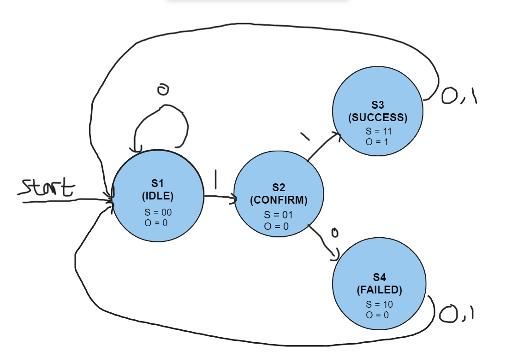
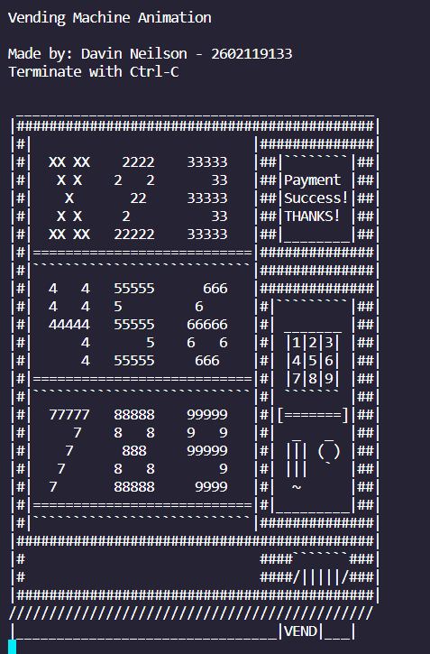

# Vending Machine - Finite State Machine
## Finite State Machine
In here, we will see how the FSM works in the Vending machine. \
The FSM image can be found here:


## Table
Here's the truth table for the FSM: \


## Karnough Map and The derived Boolean equations
Here's the Karnough map and the derived boolean equations for the FSM: \


## Running the Code
Disclaimer: Make sure your terminal's space is large. Otherwise, the vending machine won't be fully displayed.\
This is how to run the code : 
```
make run
./main.o
```

After that, this will appear: \
IDLE State: \

\
Choice 0 or others = Back to the IDLE state\
Choice 1 = Go to CONFIRM State
\
CONFIRM State:

 \
Choice 0 or others = Go to FAILED state\
Choice 1 = Go to SUCCESS state

If Success, SUCCESS State: \

\
Lastly, it will go back to the IDLE State no matter the choices are.
\
If Failed, FAILED State:\
\
Lastly, it will go back to the IDLE State no matter the choices are.

